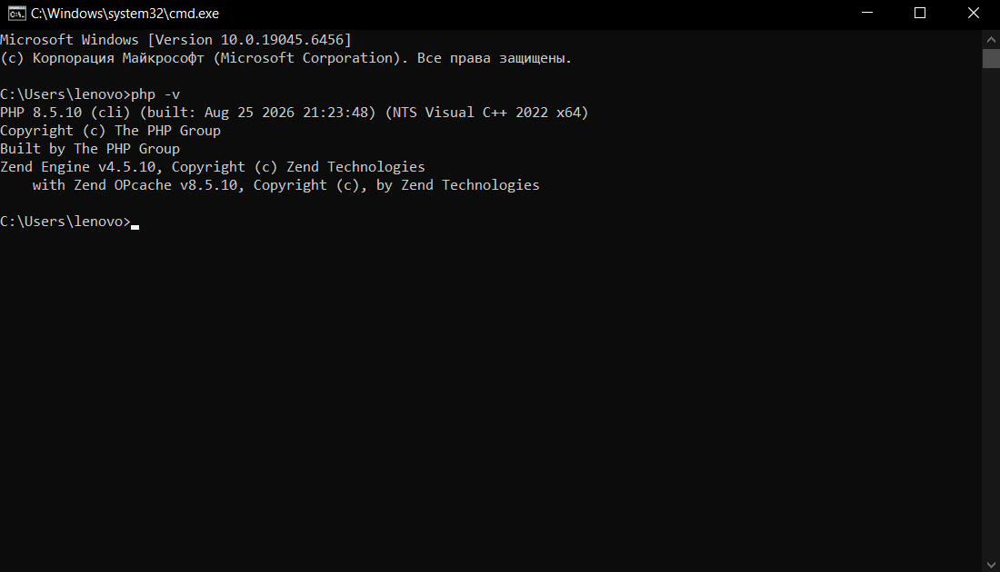
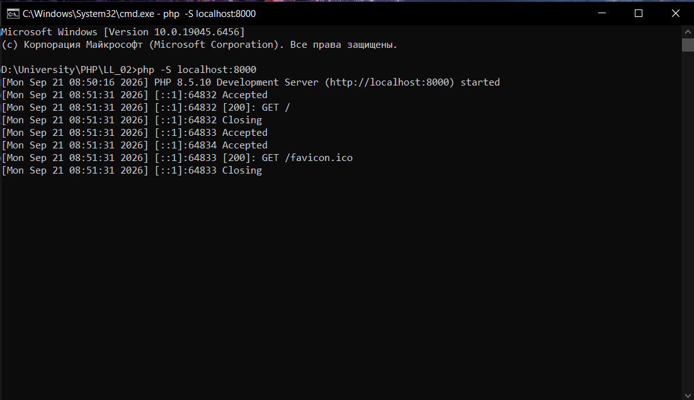
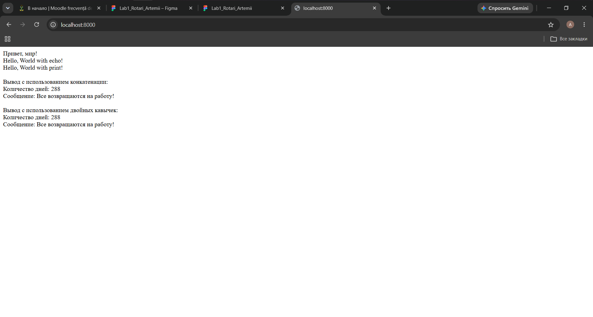

# Лабораторная работа №2. Установка и первая программа на PHP

**Дисциплина:** Advanced Web Development (PHP)  
**Студент:** Rotari Artemii  
**Группа:** I2502(RU)

## Цель работы

Цель работы состоит в том, чтобы установить и настроить PHP, проверить работу интерпретатора и написать первую программу на языке PHP.

В ходе работы также были рассмотрены способы вывода данных через `echo` и `print`, работа с переменными, конкатенация строк и подстановка значений переменных в строки.

---

## Задание 1. Установка и проверка PHP

Для выполнения лабораторной работы был установлен PHP для Windows.

После распаковки PHP путь к его директории был добавлен в системную переменную `Path`. Это позволяет запускать интерпретатор командой `php` из любой директории в командной строке.

Для проверки установки была выполнена команда:

```bash
php -v
```

Если установка и настройка выполнены правильно, команда выводит версию PHP и информацию об интерпретаторе.



---

## Задание 2. Создание первой программы

Для проекта был создан файл:

`index.php`

В него была записана первая программа:

```php
<?php

echo "Привет, мир!";
```

Тег `<?php` обозначает начало PHP-кода.

Конструкция `echo` используется для вывода данных. В данном случае программа выводит строку `Привет, мир!`.

Закрывающий тег `?>` не используется, поскольку файл состоит только из PHP-кода.

Для запуска программы из директории проекта был запущен встроенный веб-сервер PHP:

```bash
php -S localhost:8000
```

После этого страница была открыта в браузере по адресу:

`http://localhost:8000`



После обработки файла PHP браузер отображает результат выполнения программы:


---

## Задание 3. Вывод данных с помощью `echo` и `print`

Следующим шагом был проверен вывод строк двумя способами:

```php
echo "Hello, World with echo!";
print "Hello, World with print!";
```

Обе конструкции позволяют вывести текст.

Чтобы результат в браузере не отображался одной строкой, между значениями был добавлен HTML-тег `<br />`:

```php
echo "Hello, World with echo!<br />";
print "Hello, World with print!<br />";
```

В браузере для визуального переноса строки используется HTML-разметка. Символ `\n` создаёт перевод строки в обычном текстовом выводе, но браузер сам по себе не отображает его как HTML-перенос.

---

## Задание 4. Работа с переменными

По условию были созданы две переменные:

```php
$days = 288;
$message = "Все возвращаются на работу!";
```

Переменная `$days` содержит целое число, а `$message` содержит строку.

### Вывод с использованием конкатенации

В PHP для объединения строк используется оператор `.`.

```php
echo "Количество дней: " . $days . "<br />";
echo "Сообщение: " . $message . "<br />";
```

В данном случае строка и значение переменной объединяются перед выводом.

### Вывод с использованием двойных кавычек

Второй вариант использует подстановку переменных непосредственно внутрь строки:

```php
echo "Количество дней: $days<br />";
echo "Сообщение: $message<br />";
```

В двойных кавычках PHP распознаёт переменные внутри строки и заменяет их соответствующими значениями.

Оба варианта приводят к одинаковому результату, но используют разные способы формирования строки.

---

## Итоговый код программы

После выполнения всех пунктов файл `index.php` имеет следующий вид:

```php
<?php

echo "Привет, мир!<br />";

echo "Hello, World with echo!<br />";
print "Hello, World with print!<br />";

$days = 288;
$message = "Все возвращаются на работу!";

echo "<br />";

echo "Вывод с использованием конкатенации:<br />";
echo "Количество дней: " . $days . "<br />";
echo "Сообщение: " . $message . "<br />";

echo "<br />";

echo "Вывод с использованием двойных кавычек:<br />";
echo "Количество дней: $days<br />";
echo "Сообщение: $message<br />";
```

В программе последовательно показаны простой вывод текста, использование `echo` и `print`, создание переменных, конкатенация и подстановка значений переменных в строки.

Результат выполнения программы отображается в браузере после запуска локального PHP-сервера.



---

## Контрольные вопросы

### 1. Какие способы установки PHP существуют?

PHP можно установить отдельно, загрузив архив с официального сайта и добавив путь к интерпретатору в системную переменную `Path`.

Другой вариант состоит в использовании готовой сборки, например XAMPP. В этом случае вместе с PHP устанавливаются веб-сервер Apache и дополнительные инструменты.

В данной работе использовалась отдельная установка PHP.

### 2. Как проверить, что PHP установлен и работает?

Проверить установленный PHP можно командой:

```bash
php -v
```

Если интерпретатор установлен правильно и доступен через `Path`, команда выводит его версию.

Дополнительно работу PHP можно проверить запуском встроенного веб-сервера:

```bash
php -S localhost:8000
```

После этого при открытии `http://localhost:8000` браузер должен получить результат выполнения файла `index.php`.

### 3. Чем отличается `echo` от `print`?

`echo` и `print` используются для вывода данных и в простых случаях работают практически одинаково.

`echo` может выводить несколько значений и не возвращает результат.

`print` принимает одно значение и возвращает `1`, поэтому его можно использовать в выражениях.

Для обычного вывода текста чаще используется `echo`.

---

## Вывод

В ходе лабораторной работы был установлен и настроен PHP, после чего работа интерпретатора была проверена через командную строку.

Была создана первая программа в файле `index.php` и запущена через встроенный веб-сервер PHP. На практике были проверены конструкции `echo` и `print`, переменные, конкатенация строк и подстановка значений переменных в строки.

Работа показала базовый принцип выполнения PHP-программы: PHP обрабатывает код на стороне сервера, а браузер получает уже готовый результат выполнения.
